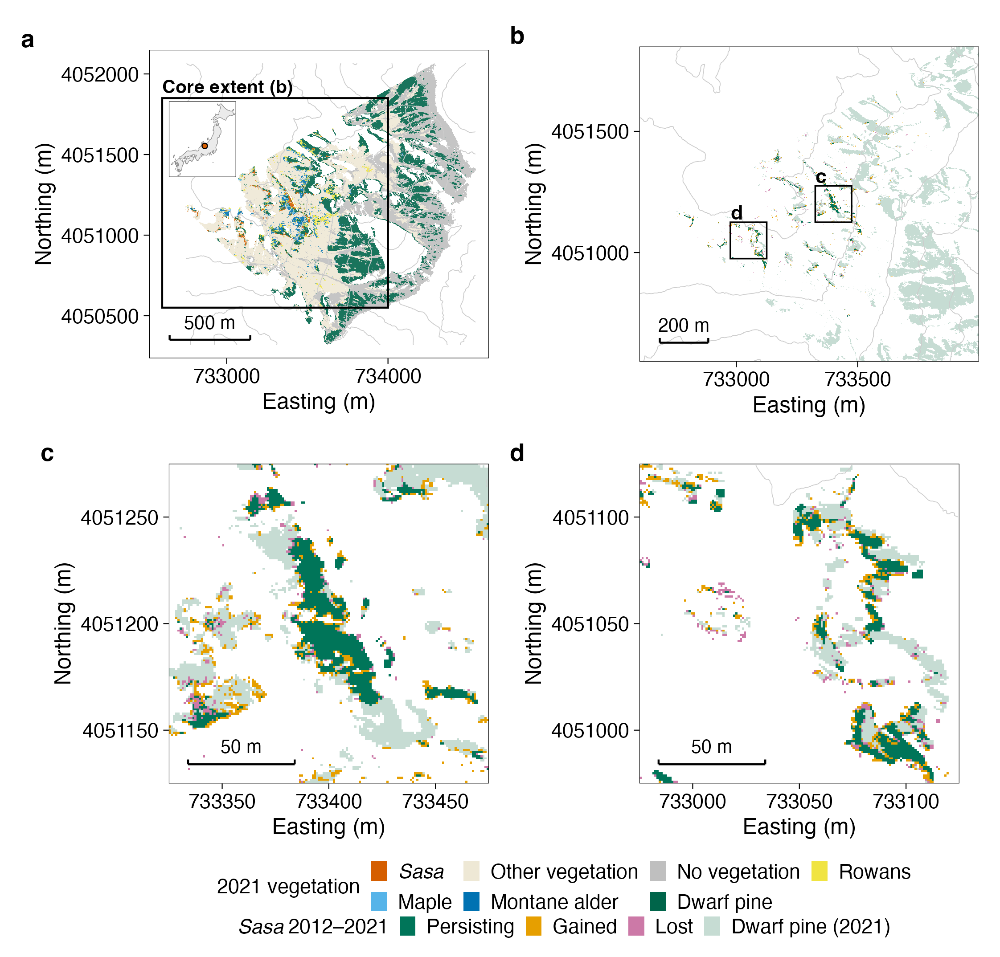
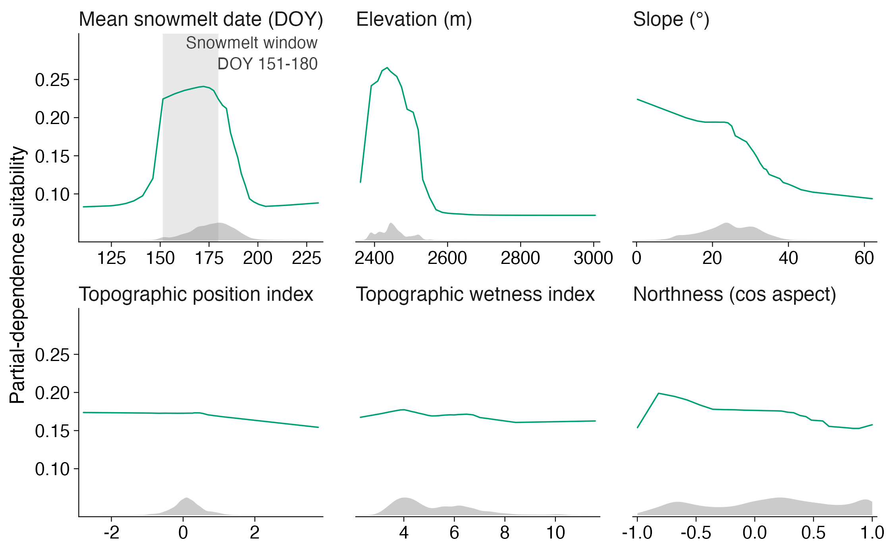
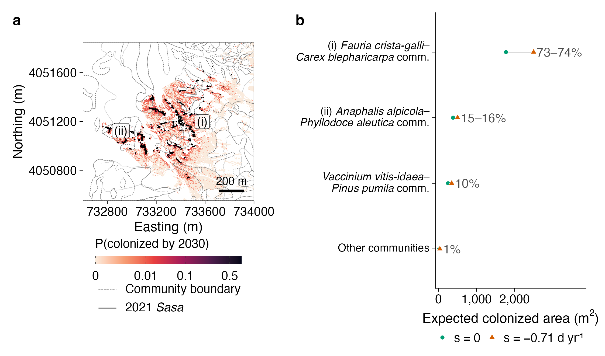

# 結果

## ササは9年間で純+19%拡大した {#sec-res-change}

ササと分類された面積（測地面積）は2012年に8,542 m²、2021年に10,170 m²で、9年間の**純変化は+1,628 m²（+19%）**であった。この純変化は、**粗拡大**4,095セル（非ササ→ササ；2012年面積の48%）と**粗減少**2,468セル（ササ→非ササ；29%）の差を反映する（@fig-sasa-change；全遷移行列は表S1。1セルの名目面積は1 m²で、測地面積との差は0.1%未満）。拡大の主な由来はその他植生（53%）とハイマツ（35%）で、落葉低木3クラス（ナナカマド類・ミネカエデ・ミヤマハンノキ）の合計は12%であった。減少の遷移先はハイマツ（47%）とその他植生（38%）が大半を占め、落葉低木3クラスの合計は15%であった。ハイマツとササは双方向に面積を交換していた（この入れ替わりの解釈は @sec-disc-change）。盲検の対画像判読では、減少セルの73–87%が「境界の揺れ」と判定され、この割合は安定対照での判定（80–85%）と実質的に変わらなかった。明瞭な樹冠被覆と判定されたのはササ→ハイマツ遷移セルの22%（8/37）で、安定ハイマツ対照での同判定（15%、3/20）をわずかに上回る程度だった。すなわち、個々の1 mセルの遷移の実体は写真スケールでは判別できない（補足情報）。 2012年のどのササセルからも孤立した2021年ササセルは地図上に少数存在するが、分類ノイズと区別できず、目視で確認された孤立新規パッチはなかった。

{#fig-sasa-change width=100%}

## 融雪時期は微地形の勾配に従い、10年間で有意なトレンドは検出されなかった {#sec-res-snow}

平均融雪日は斜面全体でおよそDOY 120から230にわたり、尾根から凹地への勾配に従った（図S2）。画素ごとの線形トレンドは91.7%のセルで負（平均−0.71日/年、中央値−0.63、SD 0.63；図S3）であったが、年別の空間平均は年による変動が大きく、景観スケールで有意なトレンドは示さなかった（−0.69日/年、95%信頼区間 −2.24〜+0.87、p = 0.34；図S1）。個々に有意（p < 0.05）な傾きをもつセルは2.0%のみで、偽発見率補正後は皆無であった。@sec-snowmelt で述べた検出力の制約のとおり、この期間は融雪の緩やかな早期化と整合するがそれを実証するものではなく、トレンドは以下でシナリオの定義にのみ用いる。

## 環境的に適した面積は占有面積を大きく上回る（モデルA） {#sec-res-modelA}

主モデルA（全標高域）はheld-out TSS 0.78（4空間ブロックの平均；範囲0.72–0.85）、AUC 0.95を達成した。LASSOブレンドに残ったのは4メンバー（勾配ブースティング木2、MaxEnt 1、ランダムフォレスト1）で、ブースティング木とMaxEntがブレンド重みの95%を担った。応答曲線（@fig-response-A）によれば、適性は平均融雪日DOYおよそ150–185の範囲で高く、DOY 172付近で最大となり、それより融雪の遅い雪田では低下した。すなわちササには適した融雪時期の範囲がある。適性はまた、標高とともに低下し、中程度の傾斜で最大となった。TPI・TWI・aspect成分の効果はより弱く非単調であった。適地面積の推定は二値化閾値に強く依存するため、held-outでTSSを最大化する閾値0.16を主として用いた（閾値感度の全体は表S2）。この閾値での適地は164×10³ m²で、実際の占有面積10.2×10³ m²の約16倍にあたる。適地面積は閾値0.55まで一貫して占有面積を上回った（@fig-models-AB a）。

{#fig-response-A width=100%}

## 定着は既存前線からの距離に強く依存した（モデルB） {#sec-res-modelB}

2012年に非ササであった1,197,536セルのうち、4,095セルが2021年までにササになった。定着GAMはleave-one-block-out評価で定着セルと非定着セルをよく判別した（プールAUC 0.946、TSS 0.75；ブロック別AUC 0.91–0.96）。同じ分割に当てはめた勾配ブースティング木の対照はAUC 0.948であり、加法モデルは柔軟な学習器が利用できるシグナルをほぼ全て捉えていた。最も強い項は2012年前線への距離であった。9年間の定着確率は前線から5 m以内で約10%、5–10 mで約1%、80 m以遠で0.1%未満に低下し、当てはめた距離帯別確率は全範囲で観測定着率とよく一致した（@fig-models-AB e；最大の乖離は0–5 m帯の0.5パーセントポイント）。環境項の方向はモデルAと一致し、融雪の遅い（ただし最も遅くはない）立地・低標高・緩傾斜で定着確率が高かった。2021年前線から評価した9年定着確率の地図（@fig-models-AB b）は既存パッチ周囲の狭い帯に集中し、最高値はパッチ下側の融雪の遅い縁辺に沿った。

{#fig-models-AB width=100%}

## 投影された定着は前線近傍で継続し、融雪シナリオへの感度は限定的である {#sec-res-projection}

2012年分布から初期化したセルオートマトンは、観測された2012–2021年の粗拡大を再現した（期待4,414 m²、観測4,093 m²；比1.08。セル単位AUC 0.92）。これは較正チェックである。独立の空間検証（各ブロックを、そのブロックを一度も見ていないモデルで予測）ではAUCは0.79–0.86であったが、ブロック単位の期待/観測面積比は0.67から2.0にわたった。定着の*位置*の判別性能はブロック間で安定していた一方、定着*量*の予測誤差は大きかった。

2021年分布から出発した2030年までの期待新規定着面積は、**変化なしシナリオ（s = 0）で4,901 m²（反復間SD 70）**、**観測速度での早期化継続シナリオ（s = −0.71日/年）で5,730 m²（SD 84）**であり、後者は前者より17%大きかった（@fig-ca-projection）。両軌跡は9年間ほぼ線形で、いずれも2012–2021年の粗拡大（測地面積4,093 m²）と同程度である。定着確率は既存パッチの下側、雪田に面した縁辺で最も高く、どのパッチからも数十m以上離れると無視できるほど小さい（@fig-ca-projection a, b）。トレンド信頼区間下限の極端シナリオ（s = −2.24日/年）では5,524 m²と、点推定シナリオをわずかに*下回った*（表S3）。投影面積は融雪早期化の単調関数ではない（機構は @sec-disc-drivers）。投影の構造感度は補足情報に示す（表S9）。

{#fig-ca-projection width=100%}

## 短期リスクは既存パッチに隣接する2つの雪田群落に集中する {#sec-res-risk}

2021年にその他植生と分類されたセルに限ると、2030年までの期待定着面積は2,429 m²（s = 0）および3,383 m²（s = −0.71日/年）であった（@fig-risk a）。環境省1:25,000植生図を重ねると、この期待面積の73–74%はイワイチョウ－ショウジョウスゲ群集の雪田群落に、15–16%はタカネヤハズハハコ－アオノツガザクラ群集の雪田群落に落ち、あわせて約9割が雪田植生であった。残る1割はハイマツ群集として図示されているが、これはハイマツ樹冠内への定着ではなく、環境省植生図の粗いポリゴンを反映したものである（@fig-risk b）。観測された2012–2021年の定着も同様の組成であった（それぞれ67%、11%、22%；表S4）。種子分散に対応する区分──その他植生内でのモデルAの適地（2021年時点、最大TSS閾値）──はこれより1桁以上大きい（図S5）。

{#fig-risk width=100%}
