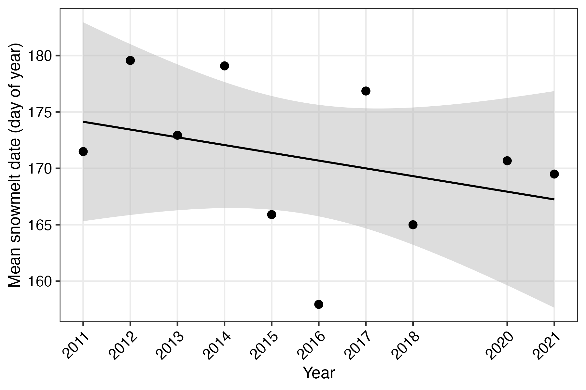
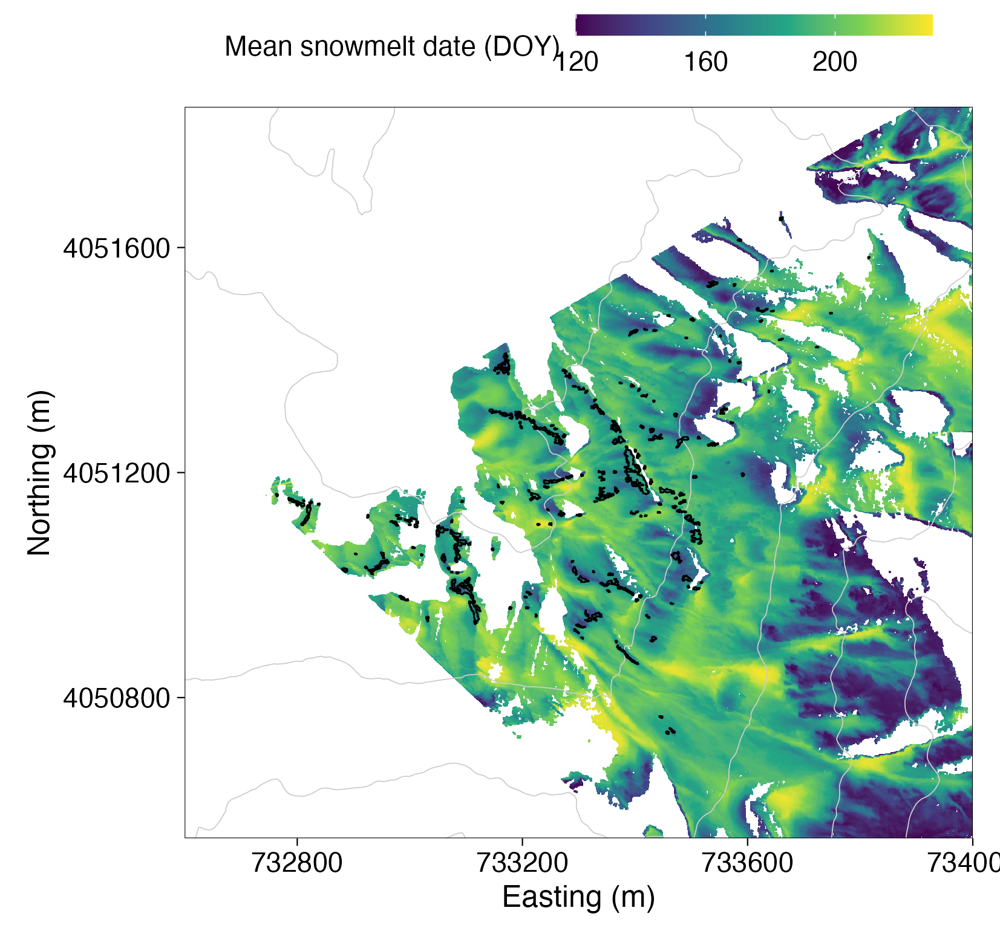
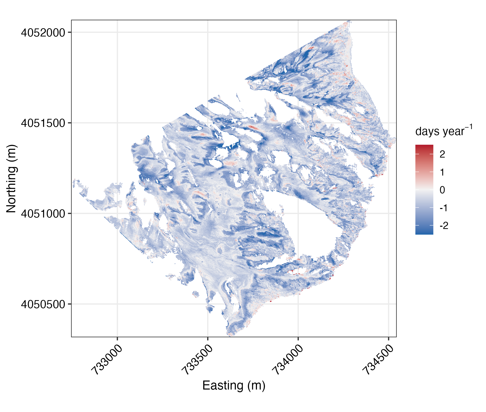
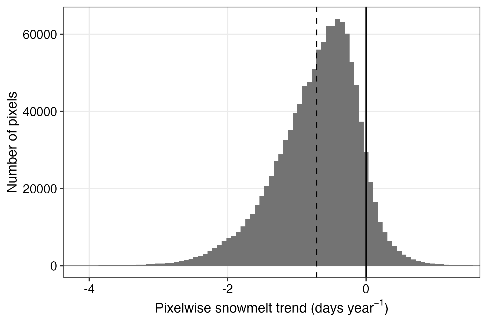
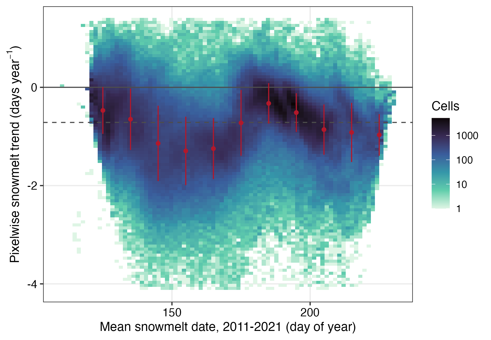
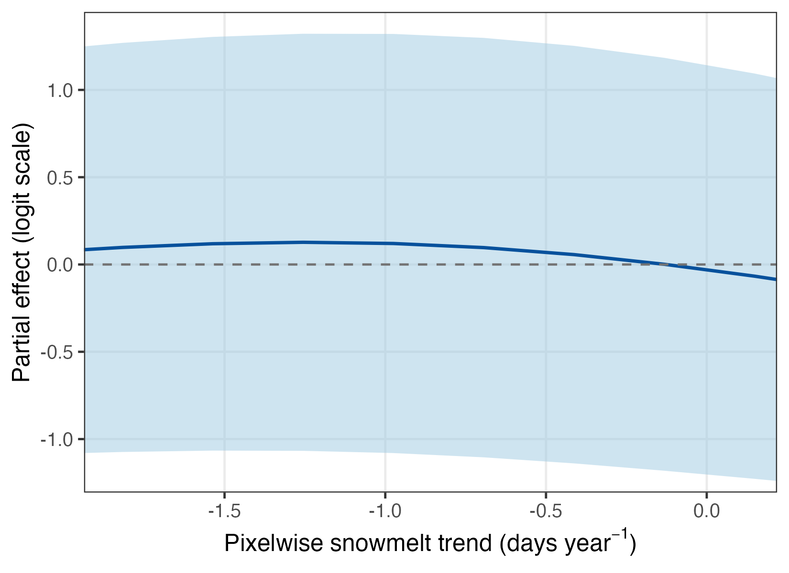
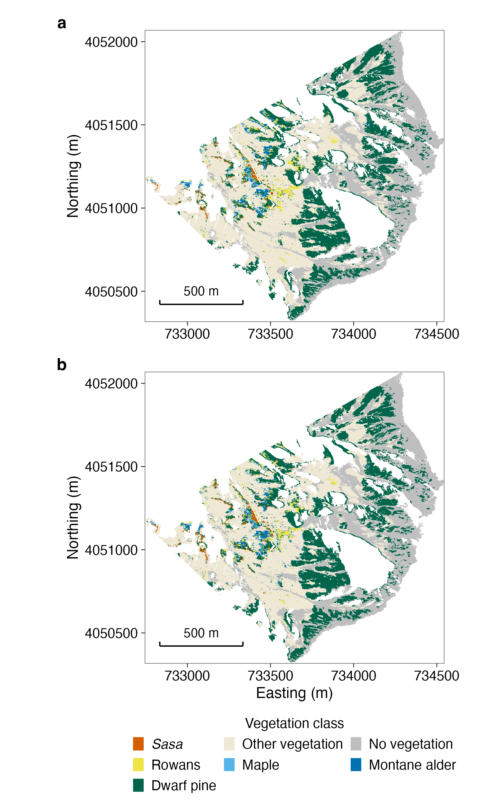
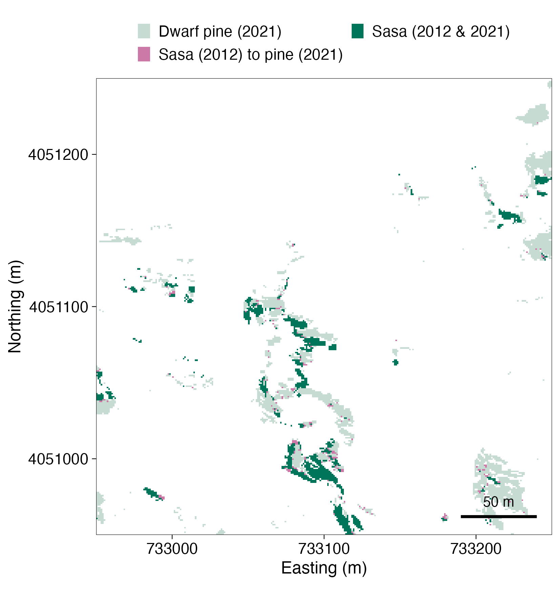
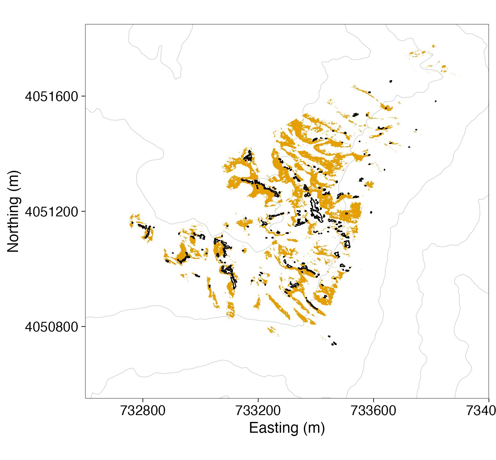

本文が「補足情報」として参照する内容を、方法の登場順にまとめる。図はS1–S7、表はS1–S12の通し番号を付す。本文が参照する番号（図S1–S3, S5, S6、表S1–S4）はここでの番号と一致する。

# 融雪レジームとトレンド

## 図S1–S3: 融雪の時系列と空間分布

{width=80%}

{width=80%}

::: {layout-ncol=2}

:::

図S3: 画素別の融雪トレンド（左: 地図、右: 傾きの度数分布）。91.7%の画素で負（平均−0.71日/年、中央値−0.63、SD 0.63、n = 1,206,063）だが、個々に有意（p < 0.05）な画素は2.0%で、Benjamini–Hochberg補正後は皆無である。右図の黒実線はゼロ、黒破線は平均（−0.71日/年）。横軸は0.1–99.9パーセンタイルで切り詰めてあり、範囲外の画素（|傾き| > 5日/年の残雪縁辺など、全体の0.2%）は表示していない。

## 融雪トレンドの検出力

10年間・残差の年間SD約9日という条件で、画素別回帰が5%水準で検出できる最小の傾きは約2日/年である。観測された平均傾き（−0.71日/年）はこの検出限界を大きく下回るため、有意性の欠如は真のトレンドの有無にかかわらず予想される。本文がトレンドを「変化の証拠」ではなく「シナリオのパラメータ」としてのみ用いるのはこのためである。

## トレンドを予測子に用いない根拠（モデルBへの追加感度分析）

採用済みのモデルB仕様に画素別トレンドの平滑項 s(trend) を追加し、同一の4空間ブロック leave-one-block-out で再評価した（表S5）。

| 評価範囲 | ベースラインAUC | +s(trend) AUC | ΔAUC |
|---|---:|---:|---:|
| ブロック1 | 0.9642 | 0.9636 | −0.0006 |
| ブロック2 | 0.9091 | 0.9084 | −0.0007 |
| ブロック3 | 0.9597 | 0.9595 | −0.0002 |
| ブロック4 | 0.9579 | 0.9574 | −0.0005 |
| プール | 0.9461 | 0.9456 | −0.0005 |

: 表S5: モデルBへの融雪トレンド追加の空間ブロック検証。AUCは4ブロックすべてで一貫して低下する。 {#tbl-s5}

s(trend) はin-sampleでは名目上有意（edf 3.15、p = 0.011、ΔAIC −8.1）だが、ブロック外の予測は改善せず、追加逸脱度説明はわずか0.03パーセントポイントであった。トレンド分布の中央90%（−1.84〜+0.12日/年）での部分効果の幅はロジットで0.13（オッズ比1.13）にすぎず、95%帯は全域でゼロを含む（図S4右）。同じモデルの距離項の幅（ロジット5.8）と比べて無視できる。すなわち定着記録はトレンドへの応答を同定できず、予測子として加えることはデータが制約できないパラメータを増やすだけである。

## 一様融雪シフトの妥当性

2030年投影のシナリオは平均融雪日への空間一様シフトである。画素別トレンド場の空間構造を確認した（図S4左）: トレンドは標高とほぼ無関係（Spearman ρ = +0.022、50 m標高ビンが説明する分散1.9%）である一方、平均融雪日に対しては**非単調**な構造をもつ（10日ビン平均が−0.47 → −1.29 → −0.33 → −0.97日/年と変動し、ビンが画素分散の24%を説明する。単調でないためSpearman ρは−0.007とゼロに近い）。したがって一様シフトは近似である。ただし、よくサンプルされた全ビンの平均は負で、いずれも景観平均±0.6日/年の範囲にあり、ビン内のばらつき（SD 0.39–0.77日/年）より小さい。本文のシナリオ域（0 / −0.71 / −2.24日/年）は全ビン平均を挟む。さらに上記のとおりトレンド場は定着の予測に寄与しないため、一様シフトはシナリオの目的に対して十分かつ意図的に保守的な近似である。

::: {layout-ncol=2}

:::

図S4: （左）画素別トレンドと平均融雪日の2次元ビン密度。赤点はビン平均±1 SD。非単調なアーチ構造がみられるが、縦方向のばらつきに比べ小さい。（右）モデルBに追加した s(trend) の部分効果（トレンド分布の中央90%域）。95%帯（灰色）は全域でゼロを含む。

# 植生分類

## 分類器の構成と精度

分類器は5×5画素パッチ上のConv2D–LSTMで、季節画像系列の葉色の時間変化を入力とする。設置・撮影・幾何補正のパイプライン全体は Okamoto, Ide & Oguma (2024, *Remote Sensing in Ecology and Conservation*) に従う。

<!-- 以下の値の出典: models/crnn.py（層構成・損失・最適化）、models/nnmodel.py（分割・
     チェックポイント・クラス別レポート）、run_crnn.py（epoch・バッチサイズ・k・多数決）、
     utils/utils.py（パッチ切り出しとスケーリング）。クラス別の数値は
     runs/cv/2012_5x5/stratified_cv.csv と runs/cv/2021_5x5/stratified_cv.csv の
     5分割平均。 -->

**入力**: 1サンプルは、位置合わせ済みの季節画像7時点を5×5画素の近傍で切り出したスタック、すなわち7時点 × 3チャネル（RGB）× 5 × 5画素である。パッチは整列済み画像系列から切り出して5×5カーネルにリサンプリングし、8ビットで保存したのち [0, 1] に再スケールしてネットワークに入力した。2年次はそれぞれ独立な7時点系列として扱い、同一構成のネットワークを2012年系列と2021年系列に別々に学習させた。

**層構成**: 各時点の画像は畳み込みブロック（`Conv2d`（3 → 8チャネル、3 × 3カーネル、ストライド1、パディングなし）→ PReLU → バッチ正規化 → `MaxPool2d`（3 × 3、ストライド1））を通り、5 × 5パッチは空間的に1点へ縮約されて1時点あたり8特徴量となる。得られた7時点 × 8次元の系列を、単層・単方向のLSTM（隠れユニット7）に入力した（実装では隠れ幅を畳み込み出力幅とクラス数の平均、すなわち ⌊(8 + 7)/2⌋ = 7 とする）。LSTMの最終隠れ状態を正規化し、7ユニットの全結合層（PReLU、バッチ正規化）を経て、第2の全結合層で7クラスのスコアに写像し、softmaxを適用した。ドロップアウト層は存在するが、率が0に設定されているため実際には使用されていない。

**学習条件**: 損失は交差エントロピー、最適化手法はRAdam（学習率 1 × 10⁻³ 固定）、バッチサイズ500、各foldにつき50 epochである。データ拡張は行っていない（学習・検証いずれの変換パイプラインも空である）。教師ラベルは手描きポリゴン216枚に由来する618,012画素で、クラスで層化した5分割交差検証（シャッフルあり）に分けた。各foldは教師画素の4/5で学習し、残りの1/5（検証fold平均123,602画素）で検証する。fold内では検証損失が最小のepochを採用した。公開する分類図は、5つのfoldモデルを全画像に適用した結果の画素ごとの多数決である。

クラス別精度を表S12に示す（5つの検証foldの平均）。注目クラスであるササのF1は両年とも0.96であった。両年で最も精度が低いのは7クラス中最も稀なミネカエデ（教師画素12,758）で、2021年の再現率は0.90まで低下する。ただし分割は画素単位であり、同一ポリゴンを両年に再利用しているため、これらの値は教師ポリゴン近傍の精度を表し、シーンの他の場所での精度に対する上限である。

| クラス | 画素数 | 2012 適合率 | 2012 再現率 | 2012 F1 | 2021 適合率 | 2021 再現率 | 2021 F1 |
|---|---:|---:|---:|---:|---:|---:|---:|
| ササ | 38,396 | 0.967 | 0.953 | 0.960 | 0.958 | 0.952 | 0.955 |
| その他植生 | 339,439 | 0.988 | 0.993 | 0.990 | 0.987 | 0.989 | 0.988 |
| 無植生 | 40,632 | 0.979 | 0.975 | 0.977 | 0.968 | 0.974 | 0.971 |
| ナナカマド類 | 29,282 | 0.972 | 0.976 | 0.974 | 0.945 | 0.938 | 0.941 |
| ミネカエデ | 12,758 | 0.971 | 0.935 | 0.953 | 0.947 | 0.896 | 0.921 |
| ミヤマハンノキ | 48,130 | 0.984 | 0.970 | 0.977 | 0.963 | 0.947 | 0.955 |
| ハイマツ | 109,375 | 0.972 | 0.972 | 0.972 | 0.963 | 0.972 | 0.968 |
| マクロ平均 | 618,012 | 0.976 | 0.968 | 0.972 | 0.962 | 0.953 | 0.957 |
| 加重平均 | 618,012 | 0.982 | 0.982 | 0.982 | 0.975 | 0.975 | 0.975 |

: 表S12: Conv2D–LSTM分類器のクラス別適合率・再現率・F1（層化5分割交差検証の5 foldの平均）。「画素数」は全foldを通じた当該クラスの教師画素の総数で、教師ポリゴンは両年で共通である。加重平均は本文で示した全体精度（2012年 0.982、2021年 0.975）に一致する。 {#tbl-s12}

## 図S6: 2012年と2021年の植生分類図

{width=100%}

## 表S1: 全クラス遷移行列（2012→2021）

行=2012年クラス、列=2021年クラス、単位=セル数（1セル≒1 m²）。両年とも有効な分類をもつモデル解析ドメイン内のセル（全予測子が有効、計1,200,936セル）で集計した。本文の粗拡大4,095・粗減少2,468と一致する。

| 2012 \\ 2021 | ササ | その他植生 | 無植生 | ナナカマド類 | ミネカエデ | ミヤマハンノキ | ハイマツ | 計 |
|---|---:|---:|---:|---:|---:|---:|---:|---:|
| ササ | 6,079 | 932 | 3 | 159 | 85 | 133 | 1,156 | 8,547 |
| その他植生 | 2,170 | 432,162 | 32,001 | 3,031 | 380 | 7,187 | 9,385 | 486,316 |
| 無植生 | 13 | 5,096 | 342,186 | 49 | 0 | 16 | 10,569 | 357,929 |
| ナナカマド類 | 224 | 3,734 | 30 | 17,282 | 871 | 2,682 | 2,104 | 26,927 |
| ミネカエデ | 155 | 624 | 0 | 1,271 | 2,523 | 703 | 424 | 5,700 |
| ミヤマハンノキ | 109 | 3,643 | 45 | 2,023 | 234 | 13,033 | 1,683 | 20,770 |
| ハイマツ | 1,424 | 5,488 | 6,418 | 1,369 | 209 | 1,189 | 278,650 | 294,747 |

: {#tbl-s1}

# ササ→ハイマツ遷移の空間検証（隣接性解析）

ササ→ハイマツ遷移（1,156セル）が既存ハイマツの境界部の現象であることを確認するため、各遷移セルから2012年ハイマツセルへのユークリッド距離を計算した（表S6）。

| グループ | n | ≤1.5 m（直接隣接） | 1.5–3 m | 3–5 m | >5 m |
|---|---:|---:|---:|---:|---:|
| ササ→ハイマツ | 1,156 | **87.5%** | 8.8% | 2.0% | **1.6%** |
| ササ→その他植生ほか | 1,312 | 39.6% | 23.6% | 16.9% | 19.9% |
| 2012年ササ全体（参照） | 8,547 | 46.6% | 27.6% | 15.2% | 10.7% |

: 表S6: 2012年ハイマツへの距離の分布。ハイマツ化セルの87.5%は直接隣接（距離中央値1.0 m）で、参照分布（46.6%）の約1.9倍に濃集する。 {#tbl-s6}

隣接帯（≤1.5 m）でのハイマツ化率は25.4%と、2–3 m帯（4.3%）の約6倍であり、3 m以遠では2%前後で頭打ちになる（分類ノイズの床とみなせる）。5 m超の孤立遷移は19 m²（遷移面積の1.6%、10クラスタ、最大4 m²）にとどまり、うち生物学的に説明困難なのは前線から21–24 m離れた2クラスタ計5 m²のみで、ササ群落内部の単発誤分類と整合的である。

# 対画像判読（盲検）

「ハイマツ枝の側方成長」と「境界混在画素の分類の揺れ」を切り分けられるかを検討するため、盲検の対画像判読を行った。減少セルの層別サンプル79件（ハイマツ37・その他植生30・落葉低木12。母集団の遷移先構成比47/38/15%に比例）、安定対照40件（両年ともササ20、両年ともハイマツ20）、逆方向遷移（ハイマツ→ササ）10件の計129件について、2012年と2021年の対画像切り出し（緑葉期・紅葉期の2組。物候差を抑えるため緑色度の近いフレーム同士を組にし、対象1 mセルの投影位置を枠で表示）を、遷移タイプを伏せたランダム順で提示した。判読者（第一著者）は各サンプルを「ササ消失・樹冠被覆・境界の揺れ・判別不能」の4区分で判定した。幾何補正の残差により枠の位置は1–2セルずれうる。「境界の揺れ」は「明瞭な変化が視認できない」場合の判定として運用された。

| 層 | n | 境界の揺れ | 樹冠被覆 | ササ消失 | 判別不能 |
|---|---:|---:|---:|---:|---:|
| ササ→ハイマツ | 37 | 73% | **22%** | 3% | 3% |
| ササ→その他植生 | 30 | 87% | 7% | 3% | 3% |
| ササ→落葉低木3クラス | 12 | 75% | 8% | 8% | 8%* |
| 安定対照（ササ→ササ） | 20 | 85% | 10% | 5% | 0% |
| 安定対照（ハイマツ→ハイマツ） | 20 | 80% | **15%** | 5% | 0% |
| ハイマツ→ササ | 10 | 80% | 10% | 0% | 10% |

: 表S10: 盲検判読の層別判定分布（*四捨五入により合計は100%にならない場合がある）。 {#tbl-s10}

判定分布は減少セルと安定対照とでほぼ同一であった。すなわち、地図上で「変化した」とされたセルと「変化していない」とされたセルを、判読者は写真から区別できなかった。樹冠被覆の判定はササ→ハイマツ遷移で22%（8/37）と、安定ハイマツ対照での同判定（15%、3/20。偽陽性率の目安となる）をわずかに上回るにとどまった。結論として、**写真スケールでは個々の1 mセルの遷移の実体（側方成長か分類の揺れか、その下でササが生存しているか）は判別できない**。本文がハイマツへの減少を「境界部の現象」と解釈する根拠は、この判読ではなく、隣接性の集中（前節）とハイマツの年枝伸長（約4–5 cm/年）による物理的制約である。減少面積を真の衰退の上限として扱う保守的な取り扱いは維持する。判読の生データと再現手順はリポジトリの `review/image_interpretation_package/` に含める。

{width=90%}

# モデルA

## 表S7: held-out性能とアンサンブル構成

| 変種 | 評価範囲 | AUC | TSS | TSS最大化閾値 |
|---|---|---:|---:|---:|
| 主モデル（全標高域） | ブロック平均 | 0.949 | 0.785 | — |
| 主モデル（全標高域） | プール | 0.944 | 0.765 | 0.158 |
| 標高制限（<2,560 m） | ブロック平均 | 0.857 | 0.583 | — |
| 標高制限（<2,560 m） | プール | 0.846 | 0.553 | 0.302 |

: {#tbl-s7}

標高制限変種の性能低下（TSS 0.78→0.58）は、モデルの劣化ではなく、ササが分布しえない高標高セルの判別が容易であることの反映である。LASSOスタッキングの採用メンバーは主モデルで4（勾配ブースティング木2、MaxEnt 1、ランダムフォレスト1）、うちブースティング木とMaxEntが重みの95%を占め、GAMメンバーは残らなかった。

予測子の共線性の全体は表S11に示す。
地形予測子（傾斜・aspect・TPI・TWI）は、国土地理院の基盤地図情報DEM（約5 mメッシュ）[@GSIdem] からQGIS上のSAGA GISツールで計算し、双一次補間で1 m解析グリッドに再投影した。したがって地形予測子の実効解像度は1 mではなく元DEMの解像度である。

## 表S11: 予測子の相関行列とVIF

| | slope | elevation | TPI | TWI | northness | eastness | 平均融雪日 | VIF |
|---|---:|---:|---:|---:|---:|---:|---:|---:|
| slope | 1 | 0.55 | 0.00 | −0.46 | −0.29 | −0.14 | −0.55 | 1.75 |
| elevation | 0.55 | 1 | 0.04 | −0.34 | −0.19 | −0.25 | −0.58 | 1.85 |
| TPI | 0.00 | 0.04 | 1 | −0.44 | 0.01 | 0.05 | −0.33 | 1.39 |
| TWI | −0.46 | −0.34 | −0.44 | 1 | 0.19 | 0.02 | 0.63 | 1.92 |
| northness | −0.29 | −0.19 | 0.01 | 0.19 | 1 | 0.48 | 0.27 | 1.23 |
| eastness | −0.14 | −0.25 | 0.05 | 0.02 | 0.48 | 1 | 0.13 | 1.22 |
| 平均融雪日 | −0.55 | −0.58 | −0.33 | 0.63 | 0.27 | 0.13 | 1 | 2.30 |

: 表S11: 採用予測子のペアワイズSpearman相関と分散拡大係数（VIF）。最大の|r|はTWI×平均融雪日の0.63、最大のVIFは平均融雪日の2.30で、いずれも慣用的な閾値（|r| < 0.7、VIF < 5）を下回る。 {#tbl-s11}

## 表S2: 適地面積の閾値感度（主モデル）

| 閾値 | 適地面積（10³ m²） | 占有面積（10.2×10³ m²）との比 |
|---:|---:|---:|
| 0.10 | 272.1 | 26.7 |
| 0.16（TSS最大） | 164.1 | 16.1 |
| 0.20 | 136.4 | 13.4 |
| 0.30 | 89.2 | 8.8 |
| 0.40 | 52.2 | 5.1 |
| 0.50 | 23.5 | 2.3 |
| 0.55 | 13.2 | 1.3 |
| 0.60 | 5.5 | 0.5 |
| 0.70 | 0.0 | 0.0 |

: {#tbl-s2}

適地面積は閾値0.55まで占有面積を上回る。0.60以上では下回るため、「適地が占有を上回る」という記述はTSS最大化閾値（0.16、16.1倍）を基準とし、本文では閾値0.55までの範囲で成立することを明記した。

## 図S5: 種子分散区分（環境ポテンシャル）

{width=80%}

# モデルB

## 距離項の仕様選択

距離項の仕様は、線形軸平滑 s(d) と対数変換平滑 s(log(1+d)) を、事前に固定した3基準で比較して選択した（表S8）。

| 基準 | 要求 | 結果 | 判定 |
|---|---|---:|---|
| プールAUCの劣化 | ≤0.005 | −0.0096（改善） | 合格 |
| 0–5 m帯の絶対誤差の削減 | ≥30% | 87.3%削減 | 合格 |
| 5–20 m帯の悪化 | なし | 改善 | 合格 |

: 表S8: 距離項仕様の事前基準による比較（線形軸 → log距離）。3基準すべてを満たしたため s(log(1+d)) を採用した。 {#tbl-s8}

採用仕様のブロック別AUCは0.91–0.96（プール0.946、TSS 0.75）。頑健性対照の勾配ブースティング木アンサンブル（同一応答・予測子・分割）はプールAUC 0.948で、加法モデルが柔軟な学習器の利用できるシグナルをほぼ捉えていることを示す。MaxEntは距離勾配に沿うクラスの準分離により maxnet/glmnet の正則化パスが収束しないため、対照から除外した。<!-- TODO: 平滑の基底次元感度（k感度）の表を追加（英語版SI作成時に実行・転記） -->

# セルオートマトン投影

## 分解の厳密性と乱数管理

線形予測子の環境部分をシナリオ×年ごとに事前計算し、シミュレーション内では距離項のみを更新した。この分解の最大再構成誤差は |Δp₉| < 8.3×10⁻¹¹（10,000セル検証、許容1×10⁻⁶）で、厳密とみなせる。乱数はレプリケートごとに固定シードを割り当て、並列スケジューリングに依存しない。

## 検証と構造感度

ヒンドキャスト（2012年分布から初期化）は観測粗拡大を比1.077で再現し（期待4,414 m² vs 観測4,093 m²）、セル単位AUCは0.92であった。空間ブロック除外検証のAUCは0.79–0.86、ブロック単位の期待/観測面積比は0.67–2.0。構造感度（表S9）:

| 感度項目 | 2030年期待面積（s = −0.71） | ベースライン比 |
|---|---:|---:|
| ベースライン | 5,730 m² | 1.00 |
| 5 m²パッチ規則を除去 | 17,226 m² | 3.01 |
| 年率化を一次近似 p₉/9 に置換 | 5,326 m² | 0.93 |

: {#tbl-s9}

## 表S3: シナリオ別の投影サマリー

| シナリオ | 2030年までの期待新規定着面積 | 反復間SD | 反復数 |
|---|---:|---:|---:|
| s = 0（変化なし） | 4,901 m² | 70 | 200 |
| s = −0.71日/年（点推定） | 5,730 m² | 84 | 200 |
| s = −2.24日/年（CI下限） | 5,524 m² | 81 | 200 |

: {#tbl-s3}

極端シナリオ（−2.24日/年）は点推定シナリオを下回る。定着が集中する前線直近の立地では、行きすぎた早期化が適した融雪時期の窓を通り越すためである（本文4.2節）。

# リスク群集の組成

## 表S4: 群集別の期待定着面積（環境省1:25,000植生図）

2021年にその他植生と分類されたセル内での2030年までの期待定着面積の内訳。参考として、観測された2012–2021年の定着（その他植生由来）の内訳を併記する。

| 群集 | s = 0 | s = −0.71 | s = −2.24 | 観測2012–2021 |
|---|---:|---:|---:|---:|
| イワイチョウ－ショウジョウスゲ群集 | 1,774 m² (73.0%) | 2,500 m² (73.9%) | 3,013 m² (74.7%) | 2,736 m² (66.8%) |
| タカネヤハズハハコ－アオノツガザクラ群集 | 383 m² (15.8%) | 501 m² (14.8%) | 567 m² (14.1%) | 467 m² (11.4%) |
| コケモモ－ハイマツ群集 | 251 m² (10.3%) | 346 m² (10.2%) | 393 m² (9.7%) | 882 m² (21.5%) |
| その他の凡例 | 21 m² (0.9%) | 36 m² (1.1%) | 59 m² (1.5%) | 10 m² (0.3%) |

: {#tbl-s4}

コケモモ－ハイマツ群集への配分は、ハイマツ樹冠内への定着ではなく、1:25,000ポリゴンと1 mグリッドの縮尺不整合（ポリゴン内部に含まれる草本セル）を反映する。
